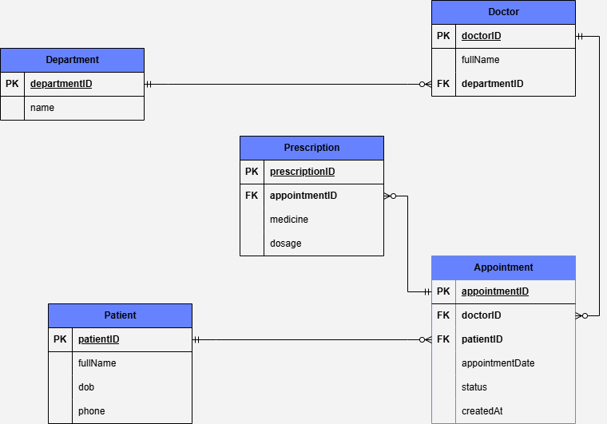

# Week 8 Assignment

This repository contains two parts for the Week 8 Assignment:
1. **Clinic Booking System** (MySQL)  
2. **Task Manager API** (FastAPI + MySQL)

---

## 🔧 Prerequisites
- MySQL Server (v5.7+ recommended)
- Python 3.8+
- pip (Python package installer)


## 🏗️ Q1: Clinic Booking System
A structured relational database designed to manage all aspects of clinic Booking System.

### 🏥 Clinic Booking ERD
Below is the Entity-Relationship Diagram (ERD) for the **Clinic Booking** database:



Schema Overview
- department: List of medical departments.
- doctor: Doctors associated with departments.
- patient: Registered patients.
- appointment: Booking records linking patients to doctors.
- prescription: Medicines prescribed during appointments.

## 🚀 SetUp
1. Clone this repository: ```https://github.com/Denis-Mwanzia/week8Assignment.git```

2. Navigate to the folder ../week8Assignment, double click it, locate clinicBooking and open it.
3. Locate clinicBooking.sql, right click on it then select open with work Bench.
4. Run the script on work Bench
